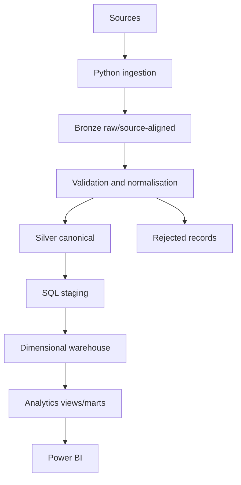

# Data Flow Diagram

```mermaid
flowchart TD
  S[Sources] --> I[Python ingestion]
  I --> B[Bronze raw/source-aligned]
  B --> V[Validation and normalisation]
  V --> Q[Silver canonical]
  V --> R[Rejected records]
  Q --> STG[SQL staging]
  STG --> DW[Dimensional warehouse]
  DW --> M[Analytics views/marts]
  M --> P[Power BI]
```
