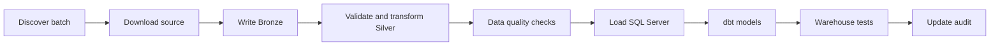

# Pipeline Orchestration Diagram

```mermaid
flowchart LR
  A[Discover batch] --> B[Download source]
  B --> C[Write Bronze]
  C --> D[Validate and transform Silver]
  D --> E[Data quality checks]
  E --> F[Load SQL Server]
  F --> G[dbt models]
  G --> H[Warehouse tests]
  H --> I[Update audit]
```
